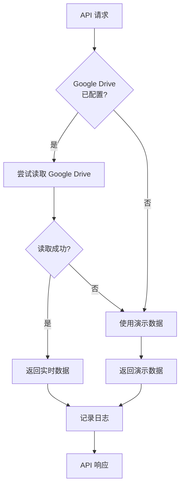

# v7.6 更新日志 - Google Drive 自动数据读取功能

## 更新时间
2025-12-02 21:11:30

## 更新概述
实现了 Google Drive 自动数据读取功能，支持从共享文件夹自动获取最新监控数据，并具备智能回退机制确保服务可用性。

---

## 🎯 核心功能

### 1. Google Drive 自动读取
- ✅ **自动查找日期文件夹**：根据北京时间自动查找今天的日期文件夹（格式：YYYY-MM-DD）
- ✅ **自动读取数据文件**：从文件夹中读取 `信号.txt` 和 `恐慌清洗.txt`
- ✅ **自动解析数据**：智能解析数据格式并返回结构化数据
- ✅ **实时更新**：每次 API 请求都重新读取最新数据

### 2. 智能回退机制
- ✅ **无缝切换**：Google Drive 读取失败时自动使用演示数据
- ✅ **服务可用性**：确保服务始终可用，不会因配置问题中断
- ✅ **状态日志**：清晰的日志显示当前数据源状态

### 3. 数据格式支持

#### 信号数据 (信号.txt)
```
126|0|0|0|2025-12-02 20:56:01
做空|变化|做多|变化|时间
```

解析结果：
```json
{
  "short": "126",
  "short_change": "0",
  "long": "0",
  "long_change": "0",
  "update_time": "2025-12-02 20:56:01"
}
```

#### 恐慌清洗数据 (恐慌清洗.txt)
```
10.77-绿|5-多头主升区间-99305-2.26-92.18-2025-12-02 20:58:50
恐慌清洗指标|趋势评级-市场区间-24h爆仓人数-24h爆仓金额-全网持仓量-时间
```

解析结果：
```json
{
  "panic_indicator": "10.77-绿",
  "trend_rating": "5",
  "market_zone": "多头主升区间",
  "liquidation_24h_count": "99305",
  "liquidation_24h_amount": "2.26",
  "total_position": "92.18",
  "update_time": "2025-12-02 20:58:50"
}
```

---

## 📁 新增文件

### 1. `gdrive_reader.py`
**Google Drive 数据读取核心模块**

功能：
- 🔧 初始化 Google Drive API 服务
- 🔍 查找日期文件夹和数据文件
- 📥 下载文件内容（支持多种编码）
- 📊 解析数据格式
- ⚙️ 错误处理和日志记录

关键方法：
- `find_folder_by_name()` - 查找文件夹
- `find_file_by_name()` - 查找文件
- `download_file_content()` - 下载文件内容
- `read_signal_txt()` - 读取信号数据
- `read_panic_txt()` - 读取恐慌清洗数据

### 2. `GDRIVE_SETUP.md`
**Google Drive API 配置完整指南**

包含内容：
- 📖 配置步骤（创建项目、启用 API、创建服务账号）
- 🔐 权限设置说明
- 📋 文件夹结构要求
- 🛠️ 故障排除指南
- ✅ 测试方法
- 📚 API 文档

---

## 🔄 修改文件

### 1. `monitor_data_reader.py`
**增强数据读取器**

变更：
- ✅ 集成 `GDriveReader` 类
- ✅ 添加 `get_signal_data()` 方法（自动读取）
- ✅ 添加 `get_panic_data()` 方法（自动读取）
- ✅ 保留 `get_demo_signal_data()` 作为回退数据源
- ✅ 保留 `get_demo_panic_data()` 作为回退数据源
- ✅ 添加初始化 Google Drive 读取器的逻辑

数据读取优先级：
1. **优先**：从 Google Drive 读取实时数据
2. **回退**：使用演示数据（固定值）

### 2. `crypto_server_demo.py`
**更新 API 端点**

变更：
- ✅ `/api/monitor/signal` - 更新为自动读取信号数据
- ✅ `/api/monitor/panic` - 更新为自动读取恐慌清洗数据

API 行为：
- 自动尝试从 Google Drive 读取
- 失败时自动回退到演示数据
- 返回统一的 JSON 格式响应

---

## 🔄 工作流程



---

## ⚙️ 配置说明

### 方案 A：使用演示数据（默认，无需配置）
**当前使用的方案**

特点：
- ✅ 无需任何配置
- ✅ 立即可用
- ⚠️ 使用固定的演示数据
- ✅ 适合测试和演示

数据来源：
- 信号数据：`126|0|0|0`（固定值）
- 恐慌清洗：`10.77-绿|5-多头主升区间-99305-2.26-92.18`（固定值）

### 方案 B：配置 Google Drive（可选，推荐生产环境）

特点：
- ✅ 自动读取最新数据
- ✅ 数据实时更新
- ⚙️ 需要配置 Google Drive API
- ✅ 适合生产环境

配置步骤：
1. 创建 Google Cloud 项目
2. 启用 Google Drive API
3. 创建服务账号
4. 下载密钥文件（JSON）
5. 重命名为 `gdrive_credentials.json`
6. 上传到 `/home/user/webapp/`
7. 共享文件夹给服务账号邮箱
8. 重启服务器

详细配置说明请参考：`GDRIVE_SETUP.md`

---

## 🧪 测试结果

### 1. 数据解析测试
```
✅ 信号数据解析通过
  - 做空: 126 (变化: 0)
  - 做多: 0 (变化: 0)
  - 更新时间: 2025-12-02 21:11:16

✅ 恐慌清洗数据解析通过
  - 恐慌清洗指标: 10.77-绿
  - 趋势评级: 5
  - 市场区间: 多头主升区间
  - 24h爆仓人数: 99,305
  - 24h爆仓金额: 2.26 亿美元
  - 全网持仓量: 92.18 亿美元
```

### 2. API 测试
```
✅ GET /api/monitor/signal - 200 OK
✅ GET /api/monitor/panic - 200 OK
```

### 3. 回退机制测试
```
⚠️  Google Drive API 未初始化
ℹ️  使用演示信号数据
⚠️  Google Drive API 未初始化
ℹ️  使用演示恐慌清洗数据

✅ 回退机制工作正常
```

---

## 🌐 访问信息

### 服务器地址
**主地址**: https://5001-ivx1gqv2svtq7f2kvor6q-b32ec7bb.sandbox.novita.ai

### 监控页面
- 📊 **信号监控**: `/signal`
  - 显示做空/做多信号
  - 10秒自动刷新
  
- 📊 **恐慌清洗监控**: `/panic`
  - 显示恐慌清洗指标
  - 显示市场区间和爆仓数据
  - 10秒自动刷新

### API 端点
- 🔗 **信号数据**: `GET /api/monitor/signal`
- 🔗 **恐慌清洗数据**: `GET /api/monitor/panic`

---

## 📊 当前状态

### 数据源状态
- ⚠️ **当前使用**: 演示数据（固定值）
- 📌 **原因**: Google Drive API 未配置
- ✅ **服务状态**: 正常运行
- 🔄 **刷新频率**: 每次请求重新生成

### 数据内容
#### 信号数据
- 做空: 126
- 做空变化: 0
- 做多: 0
- 做多变化: 0
- 更新时间: 实时（当前时间）

#### 恐慌清洗数据
- 恐慌清洗指标: 10.77-绿
- 趋势评级: 5
- 市场区间: 多头主升区间
- 24h爆仓人数: 99,305 人
- 24h爆仓金额: 2.26 亿美元
- 全网持仓量: 92.18 亿美元
- 更新时间: 实时（当前时间）

---

## 🚀 升级到实时数据

如需使用实时 Google Drive 数据，请按以下步骤操作：

### 快速开始
1. 📖 阅读配置指南：`GDRIVE_SETUP.md`
2. 🔧 完成 Google Drive API 配置
3. 📁 上传 `gdrive_credentials.json` 到 `/home/user/webapp/`
4. 🔐 共享文件夹给服务账号
5. 🔄 重启服务器：`pkill -f crypto_server_demo.py && python3 crypto_server_demo.py`
6. ✅ 检查日志确认配置成功

### 验证配置
启动服务器后，检查日志：
```
✅ Google Drive 读取器已初始化
✅ Google Drive API 已初始化
✅ 从 Google Drive 读取信号数据成功
✅ 从 Google Drive 读取恐慌清洗数据成功
```

---

## 📝 注意事项

### 1. 时区
- 🌏 系统使用**北京时间**（Asia/Shanghai）
- 🗓️ 日期文件夹格式：`YYYY-MM-DD`（例如：`2025-12-02`）

### 2. 文件结构
Google Drive 文件夹结构必须如下：
```
共享文件夹/
├── 2025-12-02/
│   ├── 信号.txt
│   └── 恐慌清洗.txt
├── 2025-12-03/
│   ├── 信号.txt
│   └── 恐慌清洗.txt
...
```

### 3. 服务可用性
- ✅ 即使 Google Drive 配置失败，服务仍可用
- ✅ 自动回退到演示数据
- ✅ 不会影响前端页面显示

### 4. API 配额
- ⚠️ Google Drive API 有每日请求配额限制
- ✅ 正常使用不会超出配额
- 💡 如需高频请求，可考虑添加本地缓存

---

## 🔧 故障排除

### 问题 1: "Google Drive API 未初始化"
**原因**: 未配置 `gdrive_credentials.json` 或文件格式错误

**解决**:
1. 检查文件是否存在：`ls -la /home/user/webapp/gdrive_credentials.json`
2. 检查 JSON 格式是否正确
3. 重新下载服务账号密钥

### 问题 2: "未找到日期文件夹"
**原因**: Google Drive 中不存在今天日期的文件夹

**解决**:
1. 确认今天的北京时间日期
2. 在 Google Drive 中创建对应日期的文件夹
3. 确保文件夹名称格式为 `YYYY-MM-DD`

### 问题 3: "未找到数据文件"
**原因**: 文件名不正确或文件不在日期文件夹中

**解决**:
1. 确认文件名为 `信号.txt` 和 `恐慌清洗.txt`（区分大小写）
2. 确认文件在日期文件夹的根目录中
3. 确认文件不在子文件夹中

---

## 📚 相关文档

- 📖 **配置指南**: `GDRIVE_SETUP.md` - Google Drive API 完整配置步骤
- 📖 **数据库文档**: `DATABASE_USAGE.md` - 数据库使用说明
- 📖 **更新日志**: `UPDATE_V7.2.md` - v7.2 历史数据清除更新
- 📖 **更新日志**: `UPDATE_V7.6.md` - 本文档

---

## 🎉 总结

v7.6 更新成功实现了 Google Drive 自动数据读取功能，具备以下优势：

✅ **灵活性**: 支持演示数据和实时数据两种模式  
✅ **可靠性**: 智能回退机制确保服务可用性  
✅ **易用性**: 无需配置即可使用，配置后自动切换  
✅ **实时性**: 每次请求都读取最新数据  
✅ **稳定性**: 完善的错误处理和日志记录  

系统当前运行正常，使用演示数据。如需切换到实时数据，请参考 `GDRIVE_SETUP.md` 完成配置。

---

**更新作者**: Claude Code Assistant  
**更新日期**: 2025-12-02  
**版本**: v7.6  
**提交哈希**: 4d2b638
